# Codebase Analysis & File Outline

## 1. Project Overview

**FutureTraveller** (also hosted as *Thriggle's JavaScript Tools*) is a web-based suite of tabletop role-playing game (TTRPG) utilities primarily designed for the **Traveller** sci-fi RPG system (specifically **Traveller 5 / T5** and **Mongoose Traveller 2nd Edition / MgT2**), along with standalone GM/solo-play tools and sci-fi simulators.

The application is built using vanilla HTML5, CSS3, and modern client-side JavaScript (with standard ES modules and classic script inclusion), accompanied by a Netlify serverless function for API-based procedural name generation and GitHub Actions for static site deployment.

---

## 2. Architecture & File Relationship Diagram

```mermaid
graph TD
    subgraph Root & Navigation
        ROOT_IDX["index.html<br/>(Main Portal)"]
        TRAV_IDX["Traveller/index.html<br/>(Traveller Hub)"]
        REDIR["TravellerSubsectorJavaScript.html<br/>(Legacy Redirect)"]
        ROOT_IDX --> TRAV_IDX
        REDIR -.-> SUBSECTOR
    end

    subgraph Core Utilities & Shared Data
        RND["Traveller/js/rnd.js<br/>(Seeded PRNG & Dice Engines)"]
        NAMES_DATA["Traveller/js/names.jsonc<br/>Traveller/js/names.js<br/>Traveller/js/namesModule.js<br/>(Syllable & Language Dictionaries)"]
        NAME_GEN["Traveller/js/NameGenerator.js<br/>Traveller/js/NameGeneratorModule.js<br/>(Markov & Template Evaluator)"]
        NAMES_DATA --> NAME_GEN
        RND --> NAME_GEN
    end

    subgraph World & System Generation
        SYS_GEN["Traveller/js/SystemGenerator.js<br/>(T5 Star System & UWP Engine)"]
        SOPH_GEN["Traveller/js/SophontGenerator.js<br/>(T5 Alien Species Generator)"]
        SYS_HTML["Traveller/SystemGenerator.html"]
        SUBSECTOR["Traveller/Subsector.html"]
        SOPH_HTML["Traveller/t5sophont.html"]
        MGT2_SYS["Traveller/mongoose2system.html"]

        SYS_GEN --> SYS_HTML
        SYS_GEN --> SUBSECTOR
        SOPH_GEN --> SUBSECTOR
        SOPH_GEN --> SOPH_HTML
        NAME_GEN --> SYS_HTML
        NAME_GEN --> SUBSECTOR
        NAME_GEN --> SOPH_HTML
        NAME_GEN --> MGT2_SYS
    end

    subgraph Character Creation Engine
        T5_CHAR_HTML["Traveller/T5Character.html"]
        CHAR_VIEW["Traveller/js/character/CharacterView.js"]
        CHAR_CORE["Traveller/js/character.js"]
        CHAR_RENDER["Traveller/js/character/character_renderer.js"]
        CHAR_DIALOG["Traveller/js/character/dialog.js"]
        CHAR_CAREERS["Traveller/js/character/careers.js"]
        CHAR_SKILLS["Traveller/js/character/skills.js"]
        CHAR_SPECIES["Traveller/js/character/species.js"]
        CHAR_HUMAN["Traveller/js/character/human.js"]

        T5_CHAR_HTML --> CHAR_VIEW
        CHAR_VIEW --> CHAR_CORE
        CHAR_VIEW --> CHAR_RENDER
        CHAR_VIEW --> CHAR_DIALOG
        CHAR_CORE --> CHAR_CAREERS
        CHAR_CORE --> CHAR_SKILLS
        CHAR_CORE --> CHAR_SPECIES
        CHAR_CORE --> CHAR_HUMAN
        CHAR_CORE --> RND
        CHAR_VIEW --> NAME_GEN
    end

    subgraph Solo RPG & Other Tools
        AUTOREF_HTML["Other/autoref.html"]
        AUTOREF_JS["Other/resources/autoref.js"]
        HEXCRAWL["Other/hexcrawl.html"]
        SOLAR_SIM["Other/SolarSystemSim.html"]
        WRDL["Other/WRDL.html"]
        WRDL_TXT["Other/resources/wrdl_solutions.txt"]

        AUTOREF_HTML --> AUTOREF_JS
        AUTOREF_JS --> NAME_GEN
        AUTOREF_JS --> RND
        WRDL --> WRDL_TXT
    end

    subgraph Serverless Backend
        NETLIFY_FUNC["netlify/functions/name.mjs<br/>(/api/names/:key)"]
        NETLIFY_FUNC --> NAME_GEN
        NETLIFY_FUNC --> NAMES_DATA
    end
```



---

## 3. Detailed File Directory & Breakdown

### 3.1 Root Directory

| File | Purpose & Functionality | Dependencies / Related Files |
| :--- | :--- | :--- |
| [`index.html`](file:///c:/code/FutureTraveller/index.html) | Main web landing page and directory index. Categorizes and links to all tools (Common Tools, T5, Mongoose 2e, and Other tools). | Links to `Traveller/*.html` and `Other/*.html` |
| [`TravellerSubsectorJavaScript.html`](file:///c:/code/FutureTraveller/TravellerSubsectorJavaScript.html) | Client-side redirect script handling legacy URLs and forwarding visitors to `Traveller/Subsector.html`. | Redirects to `Traveller/Subsector.html` |
| [`README.md`](file:///c:/code/FutureTraveller/README.md) | High-level repository description and public deployment link (`https://thriggle.netlify.app`). | None |
| [`LICENSE`](file:///c:/code/FutureTraveller/LICENSE) | Open source license terms (Apache License 2.0). | None |
| [`.gitignore`](file:///c:/code/FutureTraveller/.gitignore) | Git ignore configurations (`.vscode`, `.DS_Store`). | Git |

---

### 3.2 Serverless Backend (`netlify/`)

| File | Purpose & Functionality | Dependencies / Related Files |
| :--- | :--- | :--- |
| [`netlify/functions/name.mjs`](file:///c:/code/FutureTraveller/netlify/functions/name.mjs) | Serverless Netlify API endpoint (`/api/names/:key`) providing procedural name generation as a JSON REST API with query parameter support (`top`, `key`). | Imports `NameGeneratorModule.js` and `namesModule.js` |

---

### 3.3 CI/CD Workflows (`.github/`)

| File | Purpose & Functionality | Dependencies / Related Files |
| :--- | :--- | :--- |
| [`.github/workflows/static.yml`](file:///c:/code/FutureTraveller/.github/workflows/static.yml) | GitHub Actions workflow for deploying the repository as a static website to GitHub Pages on pushes to `master`. | GitHub Pages |

---

### 3.4 Traveller Web Applications (`Traveller/`)

| File | Purpose & Functionality | Dependencies / Related Files |
| :--- | :--- | :--- |
| [`Traveller/index.html`](file:///c:/code/FutureTraveller/Traveller/index.html) | Dedicated portal for Traveller-specific utilities including copyright notices required by the Far Future Enterprises (FFE) Fair Use Policy. | Links to tools in `Traveller/` and `Other/` |
| [`Traveller/Subsector.html`](file:///c:/code/FutureTraveller/Traveller/Subsector.html) | Comprehensive subsector generator and interactive hex-map canvas renderer. Supports generating complete subsectors (8x10 hexes), world Universal World Profiles (UWPs), trade codes, bases, stellar data, sophont presence, hex navigation, custom editing, and export to SEC format. | `SystemGenerator.js`, `SophontGenerator.js`, `NameGenerator.js`, `names.js`, `Traveller/images/*` |
| [`Traveller/SystemGenerator.html`](file:///c:/code/FutureTraveller/Traveller/SystemGenerator.html) | Full solar system generator according to T5 rules. Calculates primary, companion, and close/near/far star orbits, habitable zones, planet types, atmospheric compositions, belts, and gas giant satellites. | `SystemGenerator.js`, `NameGenerator.js`, `names.js`, `Traveller/images/*` |
| [`Traveller/mongoose2system.html`](file:///c:/code/FutureTraveller/Traveller/mongoose2system.html) | Star system and mainworld generator tailored for Mongoose Traveller 2nd Edition (MgT2) rules and tables. | `NameGenerator.js`, `names.js` |
| [`Traveller/t5sophont.html`](file:///c:/code/FutureTraveller/Traveller/t5sophont.html) | Detailed alien species (Sophont) generator implementing T5 alien creation rules: environment niches, body symmetry, senses, limbs, caste/gender structures, psychology, scent codes, and society. | `SophontGenerator.js`, `SystemGenerator.js`, `NameGenerator.js`, `names.js` |
| [`Traveller/T5Character.html`](file:///c:/code/FutureTraveller/Traveller/T5Character.html) | Interactive character creation wizard for Traveller 5. Guides players through terms of service, enlistment, commissions, promotions, skills, aging, injuries, muster-out benefits, and character sheet generation. | `CharacterView.js` (and all files in `Traveller/js/character/`) |
| [`Traveller/T5Personals.html`](file:///c:/code/FutureTraveller/Traveller/T5Personals.html) | Interpersonal encounter generator for T5 (personality traits, initial reactions, motives, personal quirks). | Inline JS |
| [`Traveller/t5Cargo.html`](file:///c:/code/FutureTraveller/Traveller/t5Cargo.html) | Random freight and speculative trade cargo lot generator for T5 trade rules. | Inline JS |
| [`Traveller/t5random.html`](file:///c:/code/FutureTraveller/Traveller/t5random.html) | Quick-reference miscellaneous T5 random roll tables (crimes, narrative themes, damage hit locations for weapons/vehicles/anatomy, weather). | `t5randomstuff.js` |
| [`Traveller/MgT2Random.html`](file:///c:/code/FutureTraveller/Traveller/MgT2Random.html) | Comprehensive random table generator for Mongoose Traveller 2e (patrons, missions, starport events, encounters, random quirks). | Inline JS |
| [`Traveller/NameGenerators.html`](file:///c:/code/FutureTraveller/Traveller/NameGenerators.html) | Interactive frontend for generating names and words across diverse sci-fi species and cultures (Human Anglic, Vilani, Aslan, Vargr, Zhodani, Droyne, Starships, Worlds). | `NameGenerator.js`, `names.js` |
| [`Traveller/family.html`](file:///c:/code/FutureTraveller/Traveller/family.html) | Procedural family tree generator producing parents, siblings, spouses, children, lifespans, and careers. | `NameGenerator.js`, `names.js` |
| [`Traveller/dieroller.html`](file:///c:/code/FutureTraveller/Traveller/dieroller.html) | Visual dice roller supporting standard dice, Nd6, Flux, Advantage/Disadvantage, and target number thresholds. | Inline JS |
| [`Traveller/StatRoller.html`](file:///c:/code/FutureTraveller/Traveller/StatRoller.html) | Characteristic rolling and point-allocation tool with interactive sliders and drag-and-drop characteristic assignment. | Inline JS |
| [`Traveller/TLStage.html`](file:///c:/code/FutureTraveller/Traveller/TLStage.html) | Tech Level (TL) stage reference matrix displaying technology availability stages (Early, Stage, Standard, Advanced, Modified) across TLs 0–33. | Inline JS |
| [`Traveller/qrebs.html`](file:///c:/code/FutureTraveller/Traveller/qrebs.html) | Equipment quality calculator implementing the T5 QREBS framework (Quality, Reliability, Ease of use, Burden, Safety). | Inline JS |
| [`Traveller/GridEditor.html`](file:///c:/code/FutureTraveller/Traveller/GridEditor.html) | 2D top-down and isometric multi-layered canvas deckplan editor for drafting starship interiors. | Inline JS |

---

### 3.5 Core JavaScript Libraries (`Traveller/js/`)

| File | Purpose & Functionality | Dependencies / Related Files |
| :--- | :--- | :--- |
| [`Traveller/js/rnd.js`](file:///c:/code/FutureTraveller/Traveller/js/rnd.js) | Seeded pseudo-random number generator implementing `xmur3` hash and `xoshiro128ss` generator. Provides RPG dice helper methods (`d6`, `flux`, `posFlux`, `negFlux`). | Used across character, name, and oracle generators |
| [`Traveller/js/NameGenerator.js`](file:///c:/code/FutureTraveller/Traveller/js/NameGenerator.js) | Core procedural name generation engine. Includes embedded `JSON.minify` parser, recursive syntax template replacement (e.g. `{human.male}`), Markov chaining, and capitalization rules. Global script format. | Uses `names.js` or `names.jsonc` |
| [`Traveller/js/NameGeneratorModule.js`](file:///c:/code/FutureTraveller/Traveller/js/NameGeneratorModule.js) | ES module export version of `NameGenerator.js` with integrated PRNG. | `namesModule.js`, `CharacterView.js`, `autoref.js`, `name.mjs` |
| [`Traveller/js/names.jsonc`](file:///c:/code/FutureTraveller/Traveller/js/names.jsonc) | Source dataset containing JSON formatted syllable dictionaries, phonotactics, prefixes, suffixes, and name templates for diverse Traveller races and cultures. | Source data |
| [`Traveller/js/names.js`](file:///c:/code/FutureTraveller/Traveller/js/names.js) | Global script wrapper around the `names.jsonc` dictionary for browser `<script>` tag usage. | `NameGenerator.js`, `Subsector.html`, etc. |
| [`Traveller/js/namesModule.js`](file:///c:/code/FutureTraveller/Traveller/js/namesModule.js) | ES module export of the name dataset for `import` statements. | `NameGeneratorModule.js`, `autoref.js`, `name.mjs` |
| [`Traveller/js/SystemGenerator.js`](file:///c:/code/FutureTraveller/Traveller/js/SystemGenerator.js) | Large-scale world & system generation engine (T5 rules). Implements star spectral typing, orbital radius math, atmosphere, hydrographics, population, government, law, tech levels, and trade code calculation. | `Subsector.html`, `SystemGenerator.html`, `t5sophont.html` |
| [`Traveller/js/SophontGenerator.js`](file:///c:/code/FutureTraveller/Traveller/js/SophontGenerator.js) | Large-scale alien biology & civilization generation engine (T5 rules). Generates ecological niches, limb topologies, senses, lifespans, mentalities, and social traits. | `Subsector.html`, `t5sophont.html` |
| [`Traveller/js/character.js`](file:///c:/code/FutureTraveller/Traveller/js/character.js) | Core lifecycle state machine for T5 character creation. Manages career terms, skill acquisitions, rank advancements, survival/injury checks, aging crises, and mustering out. | `rnd.js`, `careers.js`, `skills.js`, `species.js`, `human.js`, `dialog.js` |
| [`Traveller/js/t5randomstuff.js`](file:///c:/code/FutureTraveller/Traveller/js/t5randomstuff.js) | Quick table lookup library for random T5 events, themes, attitudes, damage locations, and environmental conditions. | `t5random.html` |

---

### 3.6 Character Subsystem (`Traveller/js/character/`)

| File | Purpose & Functionality | Dependencies / Related Files |
| :--- | :--- | :--- |
| [`Traveller/js/character/CharacterView.js`](file:///c:/code/FutureTraveller/Traveller/js/character/CharacterView.js) | Main UI controller for `T5Character.html`. Binds DOM event listeners to the character lifecycle engine and coordinates modal selection dialogs and redrawing. | Imports `character.js`, `character_renderer.js`, `dialog.js`, `human.js`, `careers.js`, `skills.js`, `species.js`, `NameGeneratorModule.js` |
| [`Traveller/js/character/character_renderer.js`](file:///c:/code/FutureTraveller/Traveller/js/character/character_renderer.js) | DOM rendering module responsible for constructing HTML representations of characteristics, skills, career history, awards, and equipment. | `CharacterView.js` |
| [`Traveller/js/character/dialog.js`](file:///c:/code/FutureTraveller/Traveller/js/character/dialog.js) | Interactive modal dialog subsystem allowing players to make choices during generation (choosing career branches, picking skills, allocating benefits). | `character.js`, `CharacterView.js` |
| [`Traveller/js/character/careers.js`](file:///c:/code/FutureTraveller/Traveller/js/character/careers.js) | Data definitions and mechanics for all standard T5 careers (Army, Navy, Marines, Scouts, Merchants, Agents, Scholars, Nobles, Citizens, Enterprisers, etc.). | `character.js`, `CharacterView.js` |
| [`Traveller/js/character/skills.js`](file:///c:/code/FutureTraveller/Traveller/js/character/skills.js) | Complete definitions of T5 Master Skills, soldier/starship skill categories, and specialized knowledge trees. | `character.js`, `CharacterView.js` |
| [`Traveller/js/character/species.js`](file:///c:/code/FutureTraveller/Traveller/js/character/species.js) | Base classes and enumerations for playable species, characteristic profiles, caste systems, and gender definitions. | `character.js`, `human.js` |
| [`Traveller/js/character/human.js`](file:///c:/code/FutureTraveller/Traveller/js/character/human.js) | Human (Solomani / Vilani) specific profile defining baseline characteristics, gender tables, and caste tables. | `species.js`, `character.js` |

---

### 3.7 Non-Traveller & Solo RPG Tools (`Other/`)

| File | Purpose & Functionality | Dependencies / Related Files |
| :--- | :--- | :--- |
| [`Other/autoref.html`](file:///c:/code/FutureTraveller/Other/autoref.html) | "Auto Ref" solo RPG oracle and GM emulator inspired by Mythic GME and classic Traveller referee guidelines. Provides probability-based fate questions, random scene generation, and word generation. | `Other/resources/autoref.js` |
| [`Other/resources/autoref.js`](file:///c:/code/FutureTraveller/Other/resources/autoref.js) | Logic engine for Auto Ref: probability fate tables, chaos/scene disruption tracking, event focus tables, and integrated name generation. | `rnd.js`, `NameGeneratorModule.js`, `namesModule.js` |
| [`Other/hexcrawl.html`](file:///c:/code/FutureTraveller/Other/hexcrawl.html) | Standalone procedural hex-crawl map generator with fog of war, terrain elevation, biome types, and movement tracking on an HTML5 canvas. | Self-contained |
| [`Other/SolarSystemSim.html`](file:///c:/code/FutureTraveller/Other/SolarSystemSim.html) | 2D interactive N-body orbital gravity physics simulator displaying orbital trajectories, gravitational attraction, velocities, and multi-body dynamics. | Self-contained |
| [`Other/WRDL.html`](file:///c:/code/FutureTraveller/Other/WRDL.html) | Interactive Wordle scratchpad and candidate word solver with letter pool inclusion/exclusion filtering and ranking. | `Other/resources/wrdl_solutions.txt` |
| [`Other/resources/wrdl_solutions.txt`](file:///c:/code/FutureTraveller/Other/resources/wrdl_solutions.txt) | Plaintext dictionary list of valid 5-letter Wordle words. | Used by `WRDL.html` |

---

### 3.8 Media, Fonts & Experimental Assets

| Directory / File | Description | Usage |
| :--- | :--- | :--- |
| [`Traveller/fonts/BAHNSCHRIFT.TTF`](file:///c:/code/FutureTraveller/Traveller/fonts/BAHNSCHRIFT.TTF), [`OPTIMA.TTF`](file:///c:/code/FutureTraveller/Traveller/fonts/OPTIMA.TTF) | TrueType font files providing the clean, classic sci-fi typography used across Traveller tools. | Web typography |
| `Traveller/images/*.png` (22 image files) | Visual icon sprites representing celestial bodies (stars, habitable worlds, inferno worlds, ice worlds, asteroid belts, gas giants, rings, radiation belts, storms). | Rendered on HTML canvas in `Subsector.html` and `SystemGenerator.html` |
| `Traveller/experimental/*.safetensors` (5 files) | Custom LoRA diffusion model weights for AI image generation (e.g. Aslan, Hiver, and Traveller Deckplans). | Experimental / Asset Generation |

---

## 4. Key Subsystem Workflows

### 4.1 Procedural Name Generation Workflow
```
[User Request / Function Call] 
       │
       ▼
[NameGenerator.js / NameGeneratorModule.js]
       │
       ├─► Evaluates seed via xmur3/xoshiro128ss in rnd.js
       ├─► Queries grammar definitions from names.jsonc / names.js
       ├─► Recursively expands template tokens (e.g. "{aslan.male.first}")
       └─► Formats capitalization & strips forbidden terms
       │
       ▼
[Generated Name Output]
```

### 4.2 Traveller 5 Character Generation Flow
```
[User selects initial parameters in T5Character.html]
       │
       ▼
[CharacterView.js instantiates createCharacter() in character.js]
       │
       ├─► 1. Roll Characteristics & Genetics (human.js, species.js)
       ├─► 2. Allocate Background Skills & Native Languages (skills.js)
       ├─► 3. Execute Terms of Service in Chosen Career (careers.js)
       │      ├─► Enlistment / Commission / Promotion Checks
       │      ├─► Survival / Injury / Crisis Rolls
       │      └─► Interactive Choices via dialog.js (Skills, Assignments)
       ├─► 4. Aging Crisis Evaluation (after Term 4)
       ├─► 5. Mustering Out & Benefit Allocation
       └─► 6. Render Formatted Output via character_renderer.js
```

### 4.3 Subsector & Star System Generation Flow
```
[Subsector.html or SystemGenerator.html]
       │
       ▼
[SystemGenerator.js + SophontGenerator.js + NameGenerator.js]
       │
       ├─► 1. Generate Hex Coordinates & Starport Presence
       ├─► 2. Generate Primary & Secondary Stars (Spectral Type / Size)
       ├─► 3. Calculate Orbital Zones (Habitable, Inner, Outer)
       ├─► 4. Generate Mainworld UWP (Size, Atmosphere, Hydrographics, Pop, Gov, Law, Tech)
       ├─► 5. Compute Trade Codes (Ag, In, Ri, Po, Wa, De, etc.)
       ├─► 6. Check for Native Sophonts (SophontGenerator.js)
       └─► 7. Draw Hex Map & System Diagram on Canvas using images/
```
