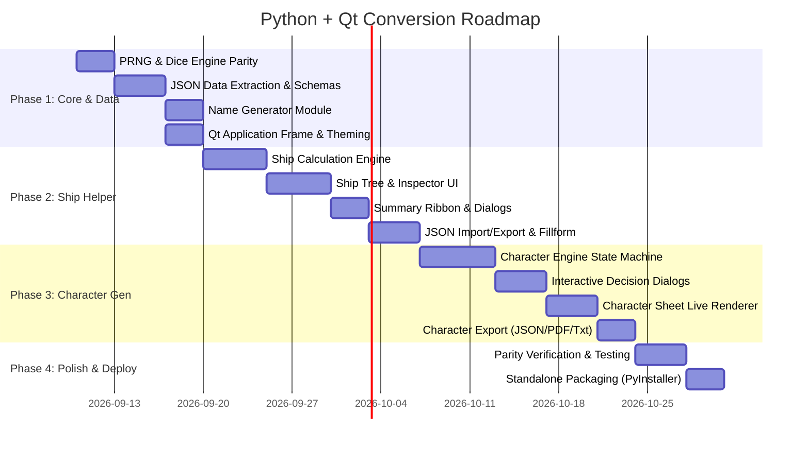

# Architecture & Conversion Outline: Porting Character Generator & Ship Helper to Python + Qt

This document provides a comprehensive technical blueprint for converting the web-based **Traveller 5 (T5) Character Generator** and **T5 Ship Helper** into standalone, cross-platform desktop applications using **Python 3.11+** and **Qt (PySide6 / PyQt6)**, leveraging the existing JSON datasets (`main_hull_data.json`, `names.jsonc`, and extracted rule tables).

---

## 1. Executive Summary & Goals

### 1.1 Objectives
1. **Desktop Native**: Create two high-performance, native desktop applications (or a unified Traveller Workbench suite with tabs/sub-windows) running on Windows, macOS, and Linux without requiring a browser or web server.
2. **Offline & Self-Contained**: 100% offline functionality with all data, rules, fonts, and assets bundled locally.
3. **Data Parity & Reusability**: Fully preserve existing data structures (`main_hull_data.json`, `names.jsonc`), while structuring hardcoded JavaScript rule tables into clean, versioned JSON schemas.
4. **Deterministic Mechanics**: Faithful Python reimplementation of the dice and seeded PRNG engines (`xmur3` and `xoshiro128ss` in `rnd.js`) to guarantee exact procedural parity.
5. **Polished Desktop UX**: Modern dark sci-fi aesthetic using Qt Style Sheets (QSS), responsive multi-pane workspaces, intuitive dialogs, drag-and-drop component palettes, and vector/PDF export capabilities.

### 1.2 Technology Stack
* **Language**: Python 3.11+ (modern typing, `match`/`case`, performance improvements).
* **GUI Framework**: **PySide6** (Official Qt for Python, LGPLv3 license, native support for Qt 6 widgets, high-DPI scaling, and modern styling).
* **Data Modeling & Validation**: `pydantic` v2 or Python standard library `dataclasses` with `json` / `json5` (for handling JSON with comments like `.jsonc`).
* **Document & PDF Generation**: Qt native `QPainter` / `QPdfWriter` / `QTextDocument` for generating official printable T5 character sheets and starship fillforms.
* **Packaging & Distribution**: `PyInstaller` or `Nuitka` to build standalone, zero-dependency `.exe` and binary distributions.

---

## 2. Source Code & Data Inventory

### 2.1 Current Web Assets & Python Mapping

```
Existing Web Files (FutureTraveller)               Target Python + Qt Modules
─────────────────────────────────────────────      ─────────────────────────────────────────────
[Shared / Core]
• Traveller/js/rnd.js                        ───►  core/dice.py & core/prng.py
• Traveller/js/names.jsonc                   ───►  data/names.jsonc
• Traveller/js/NameGenerator.js              ───►  core/name_generator.py
• Traveller/fonts/BAHNSCHRIFT.TTF            ───►  resources/fonts/
• Traveller/fonts/OPTIMA.TTF                 ───►  resources/fonts/

[Character Generator]
• Traveller/T5Character.html                 ───►  character_gen/ui/main_window.py
• Traveller/js/character.js                  ───►  character_gen/engine/character_engine.py
• Traveller/js/character/CharacterView.js    ───►  character_gen/ui/character_controller.py
• Traveller/js/character/dialog.js           ───►  character_gen/ui/dialogs/ (Modal QDialogs)
• Traveller/js/character/character_renderer.js ─►  character_gen/ui/sheet_renderer.py
• Traveller/js/character/careers.js          ───►  data/careers.json + character_gen/models/career.py
• Traveller/js/character/skills.js           ───►  data/skills.json + character_gen/models/skills.py
• Traveller/js/character/species.js          ───►  data/species.json + character_gen/models/species.py
• Traveller/js/character/human.js, aslan.js… ───►  data/species/*.json

[Ship Helper]
• Traveller/T5ShipHelper.html                ───►  ship_helper/ui/main_window.py
• Traveller/js/ShipHelper.js                 ───►  ship_helper/engine/ship_engine.py
• Traveller/js/ShipHelperView.js             ───►  ship_helper/ui/ship_controller.py & tree_views.py
• main_hull_data.json                        ───►  data/main_hull_data.json (Preserved as primary schema)
• Official 3-Page Fillforms                  ───►  ship_helper/exporters/fillform_renderer.py
```

---

## 3. Target Project Architecture

A clean modular architecture separating the data layer, game engines, UI layer, and export pipelines:

```
FutureTraveller-PyQt/
├── core/                                # Shared utilities and algorithms
│   ├── __init__.py
│   ├── dice.py                          # D6, Nd6, Flux, Advantage, Target Check
│   ├── prng.py                          # xmur3 seed hasher + xoshiro128ss PRNG
│   ├── name_generator.py                # Syllable/Markov token template engine
│   └── json_loader.py                   # JSON and JSONC parser with comments support
│
├── data/                                # Extracted and existing JSON datasets
│   ├── names.jsonc                      # Original name syllable & grammar definitions
│   ├── main_hull_data.json              # Primary ship design schema & default hull
│   ├── ship_components.json             # Component catalog (Fittings, Weapons, Avionics)
│   ├── ship_stages.json                 # Tech stages & multipliers (Early to Ultimate)
│   ├── careers.json                     # Career tables, terms, promotions, survival
│   ├── skills.json                      # Master skill tree, cascade choices, knowledges
│   └── species.json                     # Characteristics, gender tables, caste tables
│
├── character_gen/                       # T5 Character Generation Module
│   ├── __init__.py
│   ├── models/                          # Pydantic / Dataclass data models
│   │   ├── character.py                 # Stats, characteristics, genetic profile
│   │   ├── career.py                    # Career branch, ranks, awards, terms
│   │   └── skill.py                     # Skill levels, cascades, knowledges
│   ├── engine/                          # Lifecycle & Game Logic
│   │   ├── character_engine.py          # State machine for terms, aging, injury, mustering out
│   │   └── generators.py                # Homeworld, background skills, genetics
│   ├── ui/                              # Qt User Interface (PySide6)
│   │   ├── main_window.py               # Character generator main UI container
│   │   ├── wizard_view.py               # Step-by-step interactive character creator
│   │   ├── sheet_view.py                # Visual character sheet widget (QTextDocument)
│   │   ├── career_log_widget.py         # Chronicle/history viewer
│   │   └── dialogs/                     # Interactive decision dialogs (replaces dialog.js)
│   │       ├── choice_dialog.py         # Dynamic option picker with previews
│   │       ├── cascade_dialog.py        # Subskill/knowledge selection
│   │       └── mustering_dialog.py      # Cash vs benefit allocation
│   └── exporters/                       # Export formats
│       ├── json_exporter.py             # Character JSON serialization
│       ├── pdf_exporter.py              # Printable character sheet
│       └── text_exporter.py             # Plaintext / Markdown stat block
│
├── ship_helper/                         # T5 Starship Construction Module
│   ├── __init__.py
│   ├── models/                          # Pydantic models matching main_hull_data.json
│   │   ├── ship.py                      # Ship root, mission codes, baseline TL
│   │   ├── subhull.py                   # Subhull, pods, streamlining, armor layers
│   │   ├── drive.py                     # Jump, M-Drive, Power Plant, Stage mods
│   │   └── component.py                 # Fittings, accommodations, hardpoints, screens
│   ├── engine/                          # Calculation Engine
│   │   ├── calculator.py                # Volume, tonnage, EP generation vs consumption
│   │   ├── drive_math.py                # Drive rating, fuel duration, jump potential
│   │   ├── crew_math.py                 # Crew requirements vs stateroom berths
│   │   └── mission_code.py              # 6-Character mission code parser/generator
│   ├── ui/                              # Qt User Interface
│   │   ├── main_window.py               # 3-Pane workspace layout
│   │   ├── summary_ribbon.py            # Real-time summary bar (Tonnage, CP, Crew, etc.)
│   │   ├── palette_tree.py              # Available components catalog tree
│   │   ├── ship_tree_editor.py          # Subhulls & installed component hierarchy
│   │   ├── property_inspector.py        # Dynamic attribute editor for selected items
│   │   └── dialogs/
│   │       ├── mission_code_dialog.py   # Interactive 6-character code selector
│   │       ├── jump_field_dialog.py     # Astrogation & safe jump distance modal
│   │       └── fillform_viewer.py       # Official 3-page sheet viewer
│   └── exporters/
│       ├── json_exporter.py             # Import/export main_hull_data.json
│       ├── fillform_pdf.py              # Vector PDF generation of official 3-page form
│       └── text_summary.py              # Formatted design spec & trade manifest
│
├── resources/                           # Application Resources
│   ├── styles/
│   │   ├── dark_traveller.qss           # Modern sci-fi dark theme
│   │   └── syntax.qss
│   ├── fonts/
│   │   ├── BAHNSCHRIFT.TTF
│   │   └── OPTIMA.TTF
│   └── icons/                           # SVG icons for components, hulls, drives
│
├── app.py                               # Application entry point (Launcher / Main Window)
├── requirements.txt                     # Dependencies: PySide6, pydantic, json5
└── pyproject.toml                       # Build & packaging configuration
```

---

## 4. Shared Core Engine Implementation

### 4.1 Seeded PRNG & Dice Parity (`core/prng.py` & `core/dice.py`)
To ensure reproducibility matching the JavaScript `xmur3` and `xoshiro128ss` implementation:
* Implement an exact Python class `Xoshiro128SS` initialized by `xmur3(seed_str)`.
* Provide dice methods:
  * `d6(n)`: Sum of *N* 6-sided dice.
  * `flux()`: Standard Flux (`1d6 - 1d6`, range -5 to +5).
  * `pos_flux()` / `neg_flux()`: Positive/Negative Flux variations.
  * `check_target(dice_count, target, characteristic)`: Evaluates T5 difficulty thresholds (`1D` Easy through `5D` Formidable).

### 4.2 Syllable & Markov Name Generator (`core/name_generator.py`)
* Load grammar and syllable dictionaries from `data/names.jsonc` (using `json5` or a regex comment stripper).
* Implement recursive template token expansion (e.g., `{human.male.first} {human.surname}`).
* Implement Markov chain string synthesis for Vilani, Aslan, Vargr, and Zhodani names.

---

## 5. Character Generator Conversion Strategy

### 5.1 Game Engine State Machine (`character_gen/engine/character_engine.py`)
The web `character.js` manages complex turn-by-term lifecycle logic. In Python, this is modeled as a formal generator/state machine:

```
                         ┌─────────────────────────┐
                         │   1. Identity & Race    │
                         │ (Species, Sex, Genetics)│
                         └────────────┬────────────┘
                                      │
                         ┌────────────▼────────────┐
                         │  2. Background Skills   │
                         │(Homeworld, Native Lang) │
                         └────────────┬────────────┘
                                      │
                         ┌────────────▼────────────┐
                         │   3. Career Selection   │◄──────────────┐
                         │ (Draft, Enlist, Qualify)│               │
                         └────────────┬────────────┘               │
                                      │                            │
                     ┌────────────────┴────────────────┐           │
                     │         Term Execution          │           │
                     │  • Survival & Injury Checks     │           │ (Repeat up to
                     │  • Commission & Promotion       │           │  8+ terms)
                     │  • Skill Acquisition / Cascade  │           │
                     │  • Aging Crisis (Term 4+)       │           │
                     └────────────────┬────────────────┘           │
                                      │                            │
                     ┌────────────────▼────────────────┐           │
                     │      Continue or Re-enlist?     ├───────────┘
                     └────────────────┬────────────────┘
                                      │
                         ┌────────────▼────────────┐
                         │    4. Mustering Out     │
                         │ (Cash, Material Benefits│
                         │  Retirement Pay, Rank)  │
                         └────────────┬────────────┘
                                      │
                         ┌────────────▼────────────┐
                         │  5. Final Character     │
                         │   Sheet Serialization   │
                         └─────────────────────────┘
```

### 5.2 Interactive UI & Decision Architecture (`character_gen/ui/`)
* **Replacing `dialog.js`**:
  * Create `ChoiceDialog(QDialog)`: A reusable, keyboard-navigable dialog with option lists, real-time preview panes, description callouts, and validation.
  * Create `CascadeSkillDialog(QDialog)`: Handles cascading skill trees (e.g., selecting `Driver -> ACV / Grav / Wheeled`).
* **Main Character Window Layout**:
  * **Left Column**: Characteristic scores (C1-C6, Genetics, Mods), Profile summary (UPP/UWP), Current Age, Current Term.
  * **Center Column**: Step-by-step interactive action center (displays current event, choices, roll results, prompt buttons like "Roll Survival", "Pick Skill", "Re-enlist").
  * **Right Column**: Live Character Sheet preview (rendered via `QTextDocument` with CSS or rich markdown, auto-updating on every state transition).
  * **Bottom Drawer**: Collapsible chronicle log recording every roll, skill gained, and life event with dice breakdown.

---

## 6. Ship Helper Conversion Strategy

### 6.1 Calculation Engine & Data Parity (`ship_helper/engine/`)
The Python calculation engine directly processes and outputs `main_hull_data.json`:

```json
{
  "version": 1,
  "baseTL": 15,
  "subhulls": [
    {
      "isHull": true,
      "isPod": false,
      "name": "Main Hull",
      "tons": 400,
      "tl": 15,
      "config": "Airframe",
      "armorType": "Polymer",
      "armorLayers": 2,
      "drives": [ ... ],
      "components": [ ... ]
    }
  ]
}
```

#### Core Calculations:
1. **Hull Metrics**: Usable displacement tonnage, surface area, structure points, configuration coefficients (Streamlined, Airframe, Planetoid, Dispersed).
2. **Drive Systems**:
   * Sizing formulas: Power Plant EP output, Jump Drive rating vs tonnage, Maneuver Drive G-rating.
   * Tech Stage Modifiers: Generic, Standard, Improved, Modified, Advanced, Ultimate (modifying volume, fuel consumption, and MCr cost).
   * Fuel requirements: Jump fuel ($0.1 \times \text{Rating} \times \text{Tonnage}$) + Power plant operational fuel.
3. **Control Systems & Ergonomics**: Total Control Panels (CP), Consoles, Computer Cells, Ergonomics Index (E-Rating), Software packages.
4. **Accommodations & Life Support**: Staterooms (Standard, Suite, Double, Cramped, Bunk), Low Berths, Life Support duration & consumable volume.
5. **Hardpoints & Weaponry**: Turrets, Barbettes, Bays, Spinal Mounts, Screens (Meson, Force, Nuclear Damper), Sandcasters.
6. **Diagnostics & Validation**: Real-time checking of hull volume limits, power balance ($\Delta \text{EP} \ge 0$), crew staffing deficits, and jump field stability.

### 6.2 Qt User Interface Design (`ship_helper/ui/`)

```
┌────────────────────────────────────────────────────────────────────────────────────────┐
│  Traveller T5 Ship Helper  [Base TL: 15]  [Mission Code: MT-A-I-T]  [Safe Jump: 100D]   │
├────────────────────────────────────────────────────────────────────────────────────────┤
│ [Summary Ribbon] Tonnage: 400t | CP: 12 | Crew: 6/8 | Power: +45 EP | Cost: MCr 182.4 │
├─────────────────────────┬───────────────────────────────┬──────────────────────────────┤
│ Available Components    │ Installed Systems (Hierarchy) │ Component Property Inspector │
├─────────────────────────┼───────────────────────────────┼──────────────────────────────┤
│ ▼ Hulls & Pods          │ ▼ Subhull 1: Main Hull (400t) │ Component: Jump Drive Type F │
│   • Subhull             │   ► Airframe Config           │ ──────────────────────────── │
│   • External Pod        │   ► Polymer Armor (2 Layers)  │ Tech Level: [ 15 ]           │
│ ▼ Drives & Power        │   ▼ Drives                    │ Stage: [ Advanced  ▼ ]       │
│   • Jump Drive          │     • Jump Drive Type F (J-3) │ Rating: [ 3 ]                │
│   • Maneuver Drive      │     • M-Drive Type F (3G)     │ Fuel Required: 120t          │
│   • Fusion Power Plant  │     • Power Plant Type F      │ Volume: 11.67t               │
│ ▼ Accommodations        │   ▼ Accommodations            │ Cost: MCr 70.0               │
│   • Standard Stateroom  │     • 6x Standard Stateroom   │ ──────────────────────────── │
│   • Low Berth           │   ▼ Fittings & Avionics       │ [ ✓ Auto-Calculate Fuel ]    │
│ ▼ Weapons & Screens     │     • Model/3bis Computer     │ [ Remove Component ]         │
│   • Beam Laser Turret   │     • Sensor Array (Active)   │                              │
├─────────────────────────┴───────────────────────────────┴──────────────────────────────┤
│ [ New Ship ] [ Load JSON ] [ Save JSON ] [ Mission Code ] [ Official Fillform Sheets ] │
└────────────────────────────────────────────────────────────────────────────────────────┘
```

#### Key Qt UI Features:
* **`summary_ribbon.py`**: Custom widget matching the web version's summary chips (Tonnage, Config, Hardpoints, Jump Dist, CP, Ergonomics, Computers, Crew/Berths, Life Support) with visual warning highlights when power or tonnage is exceeded.
* **Component Palette & Tree Editor**: `QTreeWidget` with drag-and-drop or double-click to install systems into subhulls.
* **Property Inspector**: Context-sensitive properties panel adjusting drive stages, armor materials, weapon mounts, and crew allocations.
* **Official 3-Page T5 Fillform Viewer (`fillform_viewer.py`)**: A native previewer rendering the 3-page Traveller 5 Starship Design Sheet with high-resolution export to PDF or printer.

---

## 7. Data Layer & Migration Plan

### 7.1 Data Extraction Tasks
1. **Preserve Intact**:
   * `main_hull_data.json` $\rightarrow$ copy directly into `data/main_hull_data.json`.
   * `names.jsonc` $\rightarrow$ copy directly into `data/names.jsonc`.
2. **Extract from JavaScript to JSON**:
   * `careers.js` $\rightarrow$ Extract career lists, qualification rolls, survival targets, commission/advancement tables, and career skill matrices into `data/careers.json`.
   * `skills.js` $\rightarrow$ Extract skill master lists, cascade trees, and knowledge taxonomies into `data/skills.json`.
   * `species.js`, `human.js`, `aslan.js`, `vargr.js`, etc. $\rightarrow$ Extract characteristic baselines, gender tables, and caste tables into `data/species/*.json`.
   * `ShipHelper.js` constants $\rightarrow$ Extract drive tables, stage multipliers, accommodation specs, and armor ratings into `data/ship_components.json` and `data/ship_stages.json`.

### 7.2 Data Validation & Schemas
Use **Pydantic v2** models to validate all imported JSON files at startup, ensuring that user edits or mods to data files are validated with clear error messages.

---

## 8. Styling & Aesthetics

To maintain the sleek, immersive dark sci-fi aesthetic of the original web tools:
* **Custom Qt Style Sheets (QSS)**:
  * Dark palette background (`#0d1117`, `#161b22`, `#21262d`).
  * Sci-fi accent colors: Cyan (`#58a6ff` / `#388bfd`), Gold/Orange (`#d29922` / `#f0883e`), Emerald Green (`#3fb950`), and Alert Red (`#f85149`).
  * High-contrast borders, pill badges, and clean tabular layouts.
* **Custom Typography**:
  * Programmatically load `BAHNSCHRIFT.TTF` and `OPTIMA.TTF` into Qt's `QFontDatabase` on application startup for authentic Traveller branding.

---

## 9. Implementation Roadmap & Milestones



### Detailed Phase Breakdown

#### Phase 1: Foundation & Shared Core
* Set up repository structure, virtual environment, and dependency specifications.
* Implement `core/prng.py`, `core/dice.py`, and `core/name_generator.py`.
* Extract and validate JSON data files (`names.jsonc`, `careers.json`, `skills.json`, `ship_components.json`).
* Create Qt base theme (`dark_traveller.qss`) and font loader.

#### Phase 2: T5 Ship Helper
* Implement Pydantic models for Starships, Subhulls, Drives, and Components.
* Port all mathematical calculations from `ShipHelper.js` (Power balance, drive sizing, stage adjustments, crew equations).
* Build the 3-pane Qt workspace (`main_window.py`, `palette_tree.py`, `ship_tree_editor.py`, `property_inspector.py`).
* Implement Mission Code Builder dialog and Astrogation/Jump Field dialog.
* Build JSON save/load routines ensuring 100% roundtrip compatibility with existing `main_hull_data.json` files.
* Implement the 3-page Fillform viewer and PDF exporter.

#### Phase 3: T5 Character Generator
* Build the character creation engine state machine supporting species genetics, homeworld background, career terms, survival, commissions, promotions, skills, aging, and mustering out.
* Build the interactive Qt dialog system replacing `dialog.js`.
* Create the step-by-step interactive wizard and live `QTextDocument` character sheet view.
* Implement JSON save/load, printable PDF sheet export, and text export.

#### Phase 4: Verification, Parity Testing & Distribution
* Write automated unit tests comparing Python calculation outputs against JavaScript outputs for identical seeds.
* Validate that ship JSON files exported from the web app load flawlessly in the Qt app (and vice versa).
* Build standalone executable bundles using `PyInstaller` with icons and bundled fonts.
* Create automated GitHub Actions release workflow for Windows (`.exe`), macOS (`.dmg`/app bundle), and Linux (`AppImage`/standalone binary).

---

## 10. Verification & Quality Assurance

| Test Category | Target Component | Verification Method |
| :--- | :--- | :--- |
| **PRNG Parity** | `core/prng.py` | Verify 10,000 sequential random numbers from a fixed seed match `rnd.js` output bit-for-bit. |
| **Name Generation** | `core/name_generator.py` | Verify template expansions and Markov chains match across 1,000 sample names per culture. |
| **Ship Math Parity** | `ship_helper/engine/` | Compare volume, power output, fuel requirements, and cost against `main_hull_data.json` test ships. |
| **Ship JSON Roundtrip** | `ship_helper/models/` | Load web `main_hull_data.json` $\rightarrow$ save in Python $\rightarrow$ verify deep equality of all fields. |
| **Career Flow Checks** | `character_gen/engine/` | Run 500 automated headless character lifecycles across all careers to ensure no deadlocks or invalid states. |
| **PDF & UI Rendering** | Exporters / Qt UI | Verify clean rendering, typography alignment, and scaling on 1080p, 1440p, and 4K high-DPI displays. |
